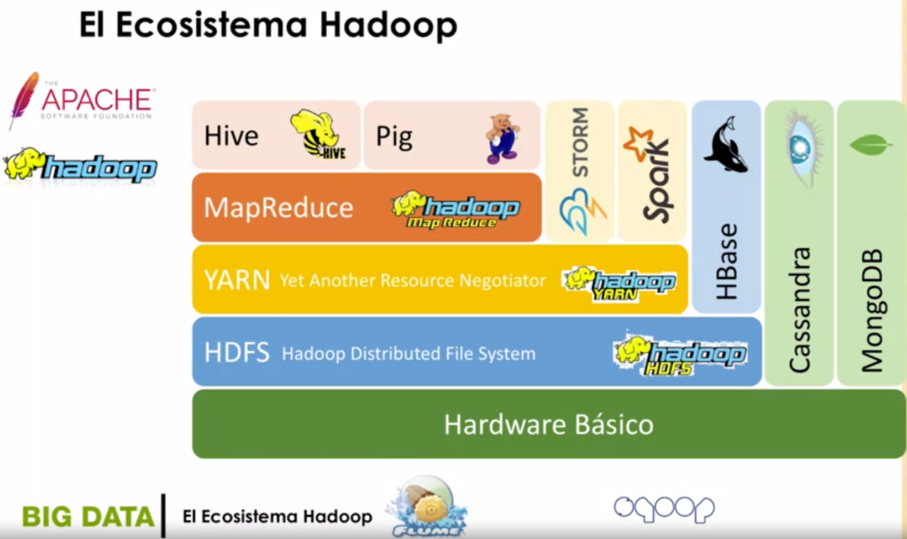

# Introducción al Ecosistema Hadoop

## Las cinco 'Vs' del Big Data.

### Volumen
> Enorme cantidad de datos.

### Velocidad
> Los datos se generan y se mueven a gran velocidad.

### Variedad
> Los datos son de distintos tipos.
> 
### Veracidad
> El grado de confianza de los datos.

### Valor
> La dificultad de explotación.

## ¿Cómo empezó?

* En 2004 Google publicó un artículo describiendo la problemática para indexar la WEB y propuso una solución.
* Esta solución se basaba en un sistema de ficheros **(GFS)** y en un modelo de programación denominado **MapReduce**.
* `Doug Cutting` vio el potencial de la solución y en 2005 **Yahoo!** lanzó una implementación basada en esta propuesta a la que llamó **Hadoop**.
* **Hadoop** es desarrollado y mantenido por **The Apache Software Foundation**.

## Objetivos del ecosistema Hadoop

### Escabilidad
> Capacidad de almacenar grandes volúmenes de datos.
### Tolerante a fallos
> Capacidad de recuperarse de errores hardware.
### Tipos de datos
> Capacidad de gestionar datos de diversos tipos.
### Entorno compartido
> Capacidad de gestionar múltiples tareas de forma simultánea.
### Aportar valor
> Capacidad de extraer valor de los datos.

## ¿Qué es el ecosistema Hadoop?

* El ecosistema **Hadoop** incluye un conjunto de herramientas y aplicaciones para alcanzar estos objetivos.
* Estas aplicaciones se pueden organizar en un diagrama de capas.
* Las capas respresentan distintas interfaces, desde el almacenamiento a los lenguajes de alto nivel.

> `Hardware básico`: Basado en nodes de almacenamiento y cómputo, no hardware de elevadas prestaciones.

> `HDFS(Haddop Distributed File System)`: Permite almacenar datos sobre los nodos del sistema. Sistema de ficheros distribuidos.

> `YARN (Yet Another Resource Negotiator)`: Gestos de recursos en el cluster.

> `MapReduce`: Modelo de cómputo.  Modelo 'framework' de programación.

> `Cassandra`: Base de datos NoSQL distribuida.

> `MongoDB`: Base de datos NoSQL orientada a documentos.

> `HBase`: Base de datos no relacional ofrecida por el entorno Hadoop.

> `STORM`: Sistema de computación distribuido en tiempo real.

> `Spark`: Framework para desarrollo de aplicaciones distribuidas.
 
> `Hive`: Infraestructura de almacenamiento(sobre MapReduce)

> `Pig`: Plataforma para crear aplicaciones MapReduce.

> `Flume`: Servicio distribuido para recopilar y mover grandes cantidades de datos.

> `sqoop`: Aplicación para transferir datos entre bases de datos relacionales y Hadoop.

