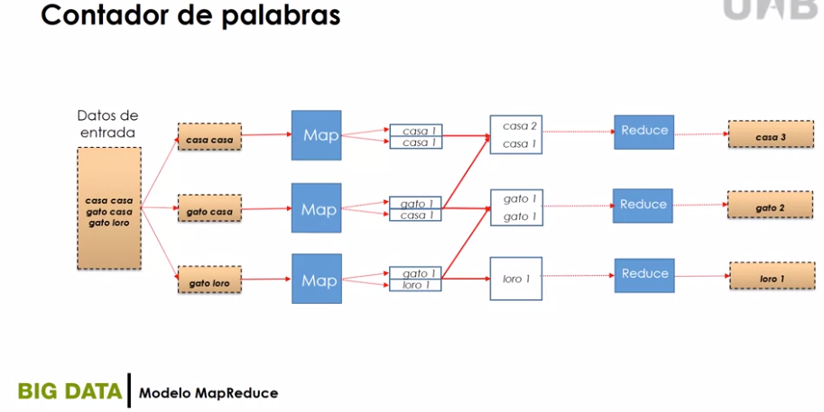

# Modelo MapReduce

## Problema típico en BigData

* Operar sobre un gran número de registros.
* Extraer información relevante de cada uno de ellos.
* Combinar y ordenar resultados intermedios.
* Agregar resultados intermedios.
*  Generar los resultados de salida finales.

> El modelo adecuado es Master-Worker

## Características de MapReduce

* MapReduce permite procesar grandes cantidades de datos en forma paralela.
* MapReduce puede explotar las características de los sistemas de cómputo paralelos/Distribuidos.
* MapReduce es un `framework` altamente escalable.
* MapReduce divide el procesamiento en dos fases fundamentales:
** La fase de mapeo `Map`.
** La fase de reducción `Reduce`.
* Los procesos que ejecutan la fase de mapeo se denominan `Mappers`. Los **Mappers** generalmente se ejecutan en los nodos en los que se encuentran los datos que va a procesar.
* El número de **Mappers** viene fijado por el framework, no por el desarrollador.
* Los Mappers realizan operaciones sobre los datos y devuelven pares `clave-valor` a la siguiente fase, la ordenación ('**sort and shuffle**').
* En la fase de ordenación los datos se ordenan y particionan de acuerdo con las claves obtenidas por los Mappers.
* Los datos particionados y ordenados se envían a los procesos reductores **Reducers**.
* Los Reducers ejecutan la fase de reducción en la que se pueden realizar distintas operaciones sobre los datos.

  
⁻ Ejemplo: Contadore de palabras:

- PseudoCódigo:

### Multiplicación de matrices
 

## Conclusiones

* Es un paradigma de programación sencillo.
* Permite explotar el paralelismo para el análisis y procesamiento de datos.
* Permite realizar distintos tipos de operaciones sobre los datos a procesar.
* Es un modelo adecuado de procesamiento que ha sido adoptado por entornos BigDara como **Hadoop**.
