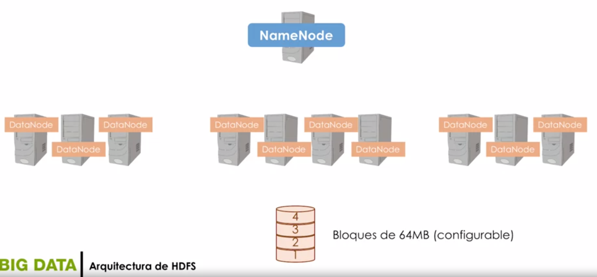
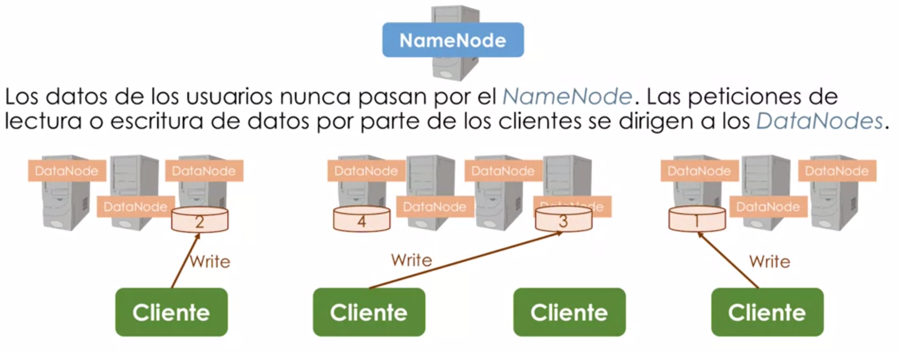
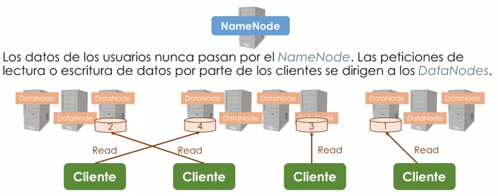
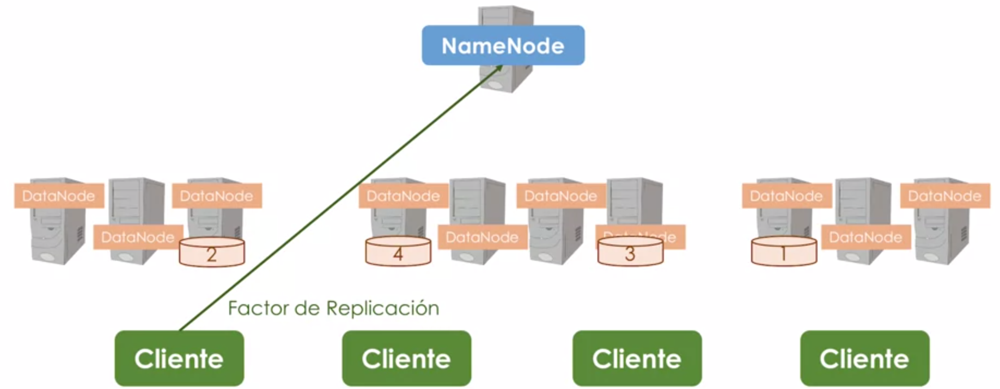
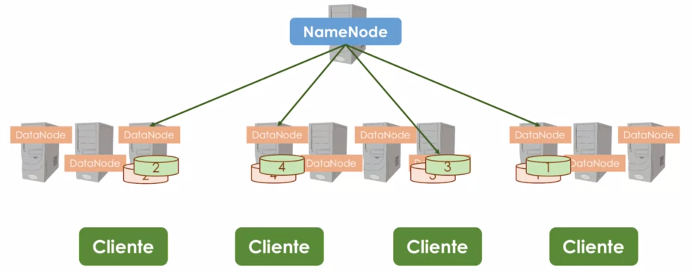
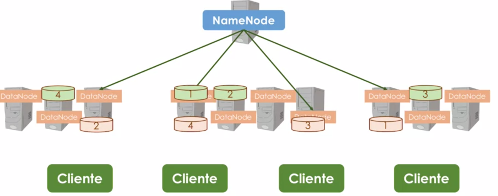
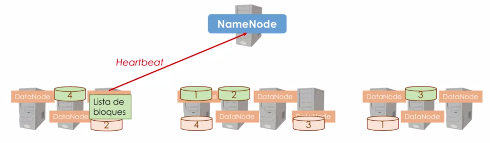
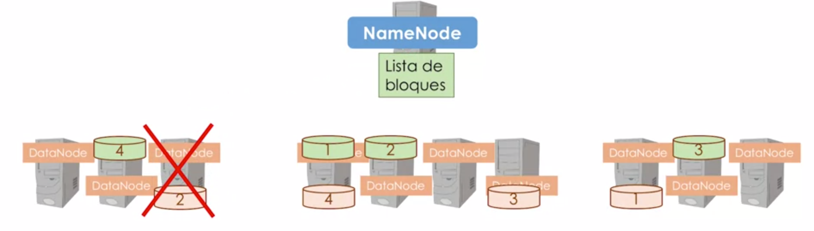
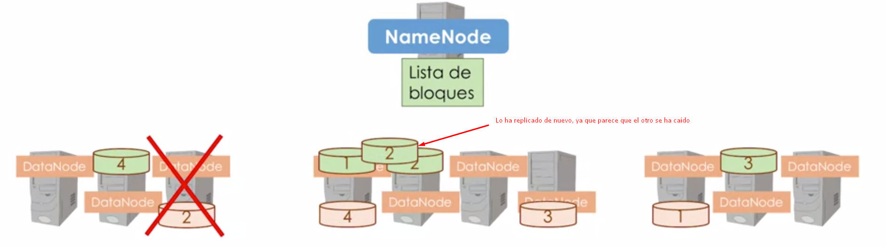
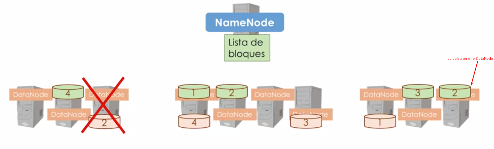

# Arquitectura HDFS (Hadoop Distributed File System)

* El *NameNode* y *DataNodes* está programados en `JAVA` y se ejecutan en máquinas comunes con sistema operativo basado en `GNU/Linux`. 

## NameNode (Espacio de nombres Namespace)
* El **NameNode** es un gestor de todos los metadatos del sistema de ficheros y actúa como repositorio de los mismos.

## DataNode (Gestión almacenamiento local)
* Uno por cada uno de los nodos del sistema.
* Va a gestionar el almacenamiento local en cada uno de los nodos.

## Ficheros
* Se dividen en conjunto de bloques.
* Bloques de 64MB (configurables).
* Cuando Tenemos los bloques de los distintos archivos, se va a realizar una asignación por parte del **NameNode** a los distintos **Nodos** del sistema. Es decir, un fichero va a estar distribuido físicamente entre bloques en los distintos nodos del clúster.

   
* Los clientes pueden introducir peticiones(Factor de replicación):

* El **NameNode** va a mandar a los **DataNodes** la petición para que realicen las replicaciones.

  
* Las replicaciones se envían a otros nodos, con lo cual tenemos varias copias de los distintos bloques, ya que es posible que algún nodo caíca. Con la replica podemos recuperarlo.

  
* Para poder controlarlo, es mediante unas señales(periódicas) que envían los **DataNodes** (`Heartbeat`) hacia el **NameNode**, indicando que está activo, y enviando la lista de los bloques que dispone.

  
* Si se cae un **DataNode**

  

## HDFS: Accesibilidad

* HDFS proporciona una `API JAVA` para que las aplicaciones puedan acceder a los archivos.
* También se puede utilizar un `Wrapper` para acceder a este `API JAva` desde `C`.
* HDFS ofrece una interface de línea de comandos denominada `FS Shell` que permite interactuar con el sistema de archivos.
  * Ejemplo de FS Shell:
    * Creación de un directorio -> `bin/hadoop fs -mkdir /foodir`
    * Eliminación de un archivo -> `bin/hadoop fs -rm foodir/myfile.txt`
    * Visualizar un archivo     -> `bin/hadoop fs -cat /foodir/myfile.txt`