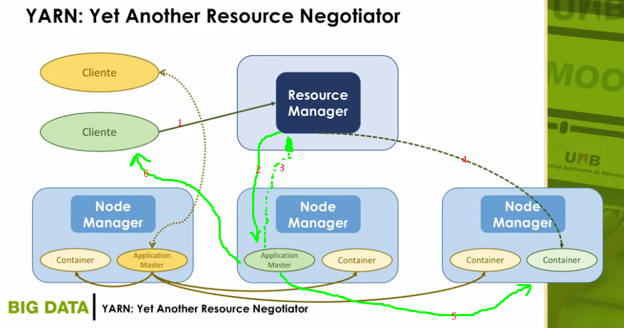

# YARN Yet Another Resource Negotiator

* Es un gestor de recursos y aplicaciones que pretende extender el procesamiento en los clusters Hadoop más allá del modelo MapReduce.
* YARN incluye dos aspectos fundamentales:
    * Gestión de recursos.
    * Planificación y monitorización de tareas.
    
## `Resource Manager`
* Encargado de gestionar todo el sistema de archivos
* Va a contener un `Scheduler`(Planificador), se va a encargar de asignar las tareas entre los distintos nodos del sistema.
    * Pueden introducirse schedulers como `Plug-ins`.
* `ApplicationManager`(Gestor de aplicaciones), gestor de las aplicaciones.
    * Acepta envíos de tareas y gestiona la ejecución
    
## `Node Manager`
* Van a controlar recursos locales del nodo. Van a recibir las tareas que va asignando el **Resource Manager**.
* Un agente por nodo.
* Gestiona un node de cómputo individual.
* Manda información actualiza al **Resource Manager** sobre el estado del nodo.

## `Application Master`
* Nodo encargado de la ejecución de una aplicación.
* Pide recursos para ejecutar la aplicación.
* Controla la ejecución de la aplicación.

## `Container`
* Aquellos recursos que se van a ejecutar para realizar una tarea en especial.
* Especificación de recursos:
    * Número de núcleos
    * Cantidad de memoria.
    
