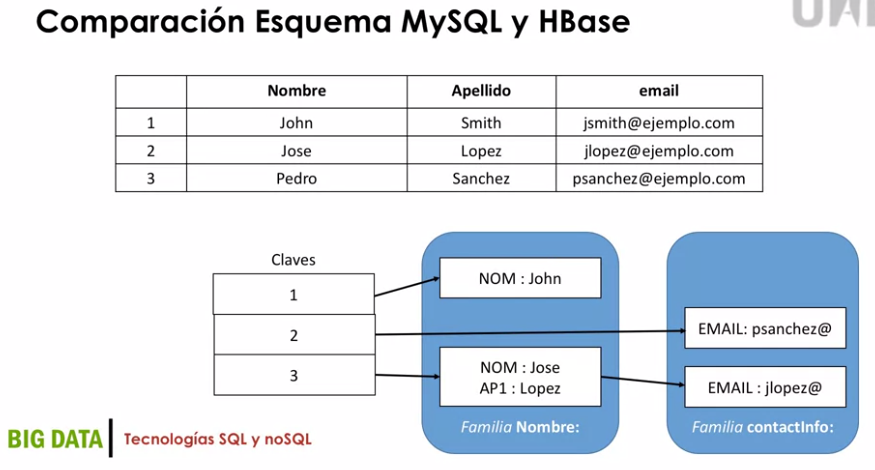
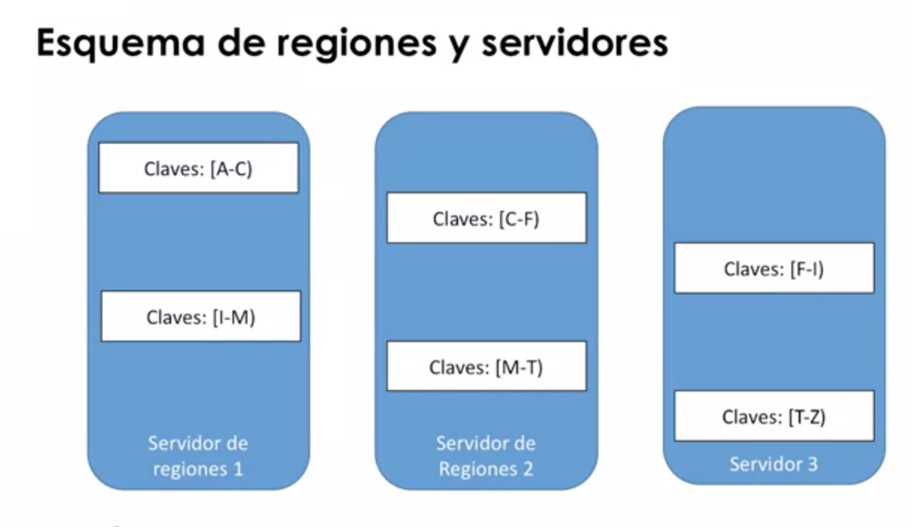

## Proyectos que agregan datos de los usuarios

* Google PageRank
* Reconocimiento de voz de smartphone
* Predicción de crecimiento de la gripe usando las consultas de los usuarios
* APIs  de datos públicos de diferentes servicios online 
* Captura de datos de dispositivos inteligentes: teléfonos, pulseras de monitorización, relojes inteligentes, datos de aplicaciones móviles,...

## Trabajar con datos a escala

* El volumen de los datos se convierte en parte del problema.
* Trabajamos con plataformas de información o espacios de datos (datamart).
* Parte del objetivo es explorar e interpretar los datos.
* Los datos pueden tener cualquier formato.
* Los esquemas de datos pueden evolucionar, no están cerrados.
* Hay que ir más allá del modelo de base de datos relacional.

## Limitaciones de las Bases de Datos relacionales

* No son muy eficientes a gran escala.
* Es muy complejo cambiar los esquemas de datos.
* Replicar servidores y aplicar técnicas de particionado de datos es difícil de gestionar.
* Hay aplicaciones en las que no es necesario mantener la consistencia de datos: resultado en buscador web.

## Nuevos tipos de servidores de datos

* Descendientes de **Google BigTable** y **Amazon Dynamo**.
* Diseñados para ser distribuidos en múltiples nodos.
* Proporcionan consistencia parcial.
* Permiten esquemas de datos flexibles.
* Explosión actual de sistemas de código abierto: **Cassanda**, **Hbase**, **CouchDB**, **mongoDB**,...

## Gestionar la escalabilidad con MySQL

* Ejemplo: aplicación de analítica web. Conocer el número de visitas de una cierta URL que estamos analizando.
* Tenemos un registro de cada vez que se ha recibido una petición web con la URL y la fecha y hora de la petición.
* Necesitamos construir una aplicación para conocer en todo momento el Top100 de las páginas web más visitadas según nuestros registros.

> Tendremos que incrementar una determinada fila de la BD por visita

| **Nombre de la columna** | **Tipo de dato** |
| --- | --- |
| IDENTIFICADOR | Integer |
| NUMERO DE USUARIO | Integer |
| URL | Varchar(255) |
| VISITAS | Bigint |

> Cola de atención a peteiciones

* **Error d e timeout al insertar en la base de datos**: llegan tantas visitas a la web que la BD no puede escribirlas todas a tiempo.
* Montamos una cola de peticiones entre el servidor web y la BD.

```console
SERVIDOR_WEB----pageview--->COLA------100peticiones--->WORKER-------------->DB
```
> El servidor recibe más peticiones
* Problema: ¿Cómo escalar BD relacionales con muchas peticiones de escritura?
    * Usar múltiples servidores de BD y distribuir las tablas entre todos.
    * Técnicas de particionado horizontal: cada servidor tendrá un subconjunto de la tabla.
    * Esta técnica distribuye la carga de operaciones de escritura entre múltiples máquinas.

> Partición horizontal o sharding
* Se divide visitas en varios `shards`.
```console
  DB      |----> Visitas_1
visitadas |----> Visitas_2
          |----> Visitas_3
```
* Implicaciones del sharding
    * Necesitamos un método para particionar la tabla en segmentos distribuidos uniformemente para balancear bien la carga.
    * Necesitamos un método propio para distribuir los valores a su partición correspondiente. Normalmente se usa una función HASH.
    * La nueva manera de calcular el top100 es obtener el top de cada segmento y luego agregarlos para obtener el top 100 global.
    
> Limitaciones de la tecnología SQL
* Es difícil gestionar la tolerancia a fallos. Si un segmento falla, no podemos escribir los resultados.
* La complejidad de la gestión se deriva a la aplicación, que necesita calcular el segmento correspondiente a cada valor.
* Cualquier error que inserte valores en el segmento equivocado es muy difícil de gestionar.
* Las tareas de mantenimiento se vuelven muy complejas: ¿Cómo plantear una resegmentación?

## Propiedades deseadas de NoSQL

Necesitamos una base de datos que gestione automáticamente:
* La naturaleza distribuida de los repositorios de datos.
* La gestión de las particiones de los datos.
* La inserción escalable de grandes cantidades de datos.
* La realización de consultas de forma escalable con baja latencia.
* La gestión de la tolerancia a errores y robustez del sistema.
* De propósito general para diferentes tipos de aplicaciones.

### Ejemplo de BD distribuida: `HBase`(NoSQL):
* Persistente
* Distribuida
* Datos ordenados
* Multidimensional
* Baja densidad(sparse)
#### Características de Hbase
* Construida sobre sistemas de archivos distribuidos(`HDFS`):
  * Los datos están en diferentes servidores.
  * Se pueden replicar los datos en diferentes nodos.
* Los datos están almacenados en orden alfabético de un valor (clave).
* Es multidimensional:
  * Los datos se organizan en familias.
  * Cada familia puede almacenar cualquier número de columnas.

> Filas, Familias, cualificadores y tiempos

| **Calve de la fila** | **Familia Nombre** | **Familia contactInfo** |
| --- | --- | --- |
| 1 | Nombre:{'NOM': 'John', 'AP1'='Smith'} | ContactInfo:{'EMAIL':'jsmith@ejemplo.com'} |
| 2 | Nombre:{'NOM': 'Jose', 'AP1'='Lopez'} | ContactInfo:{'EMAIL':'jlopez@ejemplo.com'} |
| 3 | Nombre:{'NOM': 'Pedro', 'AP1'='Sanchez'} | ContactInfo:{'EMAIL':'psanchez@ejemplo.com'} |

> La familia nombre tiene dos cualificadores -> `NOM` y `AP1`
 
> La familia contactInfo tiene 1 cualificador -> `EMAIL`

> Ahora podremos preguntar por valores en la tabla usando familia:cualificado

 

#### Auto-sharding: escalabilidad automática
* Región: un rango de filas de datos contiguas que se almacenan juntas.
* Una región forma una unidad mínima de balanceo de carga.
* Cuando una región crece demasiado: se divide en dos partes iguales.
* Cada servidor almacena un cierto número de regiones y se mantiene balanceado de forma continua.
 
