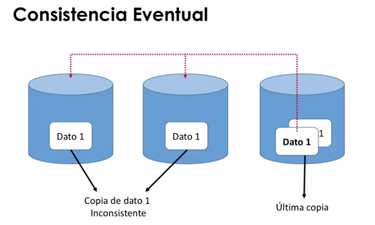

## Consistencia de los datos
* La consistencia en entornos distribuidos de datos.
* Teorema CAP.

### Objetivos
* Garantizar que los datos almacenados en una base de datos son veraces siempre.
* Cada vez que se realiza una operación en la base de datos, el resultado no invalida el estado previo.
* Hay diversas formas de mantener la consistencia de datos al realizar una nueva operación:
    * Asegurar un nuevo estado consistente.
    * Volver al anterior estado consistente.
    
### Modelos
* **Estricta:** los cambios en los datos son atómicos y tienen efecto de forma instantánea.
* **Secuencial:** cada cliente ve los cambios en el orden en el que se produjeron.
* **Causal:** los cambios aparecen siguiendo su orden causal.
* **Eventual** los cambios se propagan por todo el sistema cuando no haya cambios pendientes de realizarse.
* **Débil:** no hay garantías de que los cambios se propaguen de forma causal

### Gestionar errores en datos remotos
* Orientarse a mantener la consistencia.
    * Si los datos no están actualizado se produce un error.
* Orientarse a mantener la disponibilidad.
    * Retornar la última versión disponible de los datos, aunque no sea la última.
* Si no hay errores, ¡se puede mantener la consistencia y la disponibilidad!

### Teorema CAP

Propiedades de los sistemas compartidos y distribuidos de datos.

En caso de fallo solo podemos tener sistemas que cumplan **dos de estas tres** propiedades:
1. Consistencia de datos: **C**onsistency 
2. Disponibilidad del sistema: **A**vailability
3. Tolerancia al particionado de la red de interconexión: **P**artitioning

### ¿Consistencia o disponibilidad?

En grandes sistemas distribuidos en torno de red muy particionado. Dos opciones
* Consistencia: el sistema no estará disponible.
  * NO se puede escribir en la BD momentáneamente.
* Disponibilidad de los datos: se relaja la consistencia de los datos entre particiones del sistema.
  * La lectura de un dato puede no reflejar el último valor.

> `Consistencia Eventual` (Como una aproximación a las 2)

* Modelo de consistencia débil: permite a los clientes actualizar cualquier réplica en cualquier momento.
* Garantiza que todas las actualizaciones se realizan en todas las réplicas en un orden que preserva la consistencia.

### Herramientas y requerimientos

* Para disponibilidad y Tolerancia a particionado:
  ** Cassandra DB.
  
* Para consistencia y disponibilidad:
  * HBASE, MongoDB
  