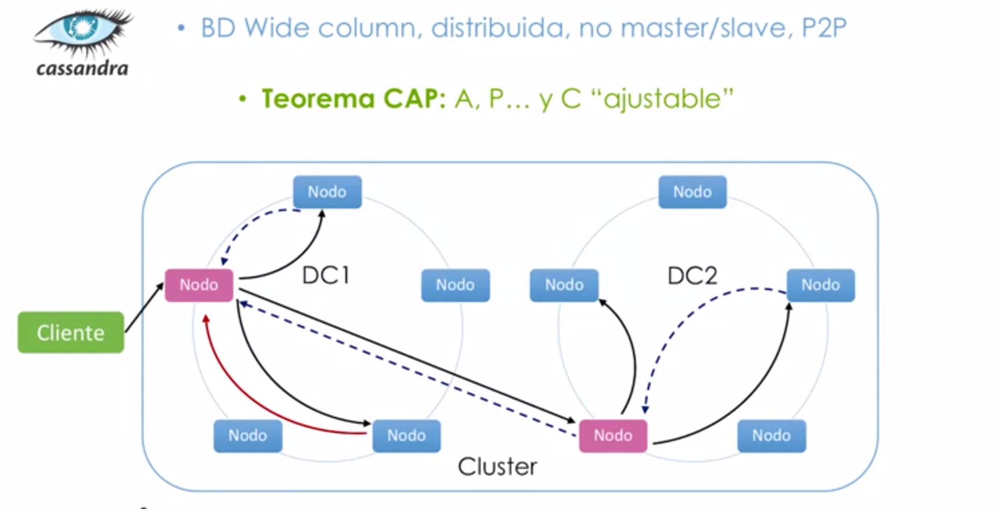
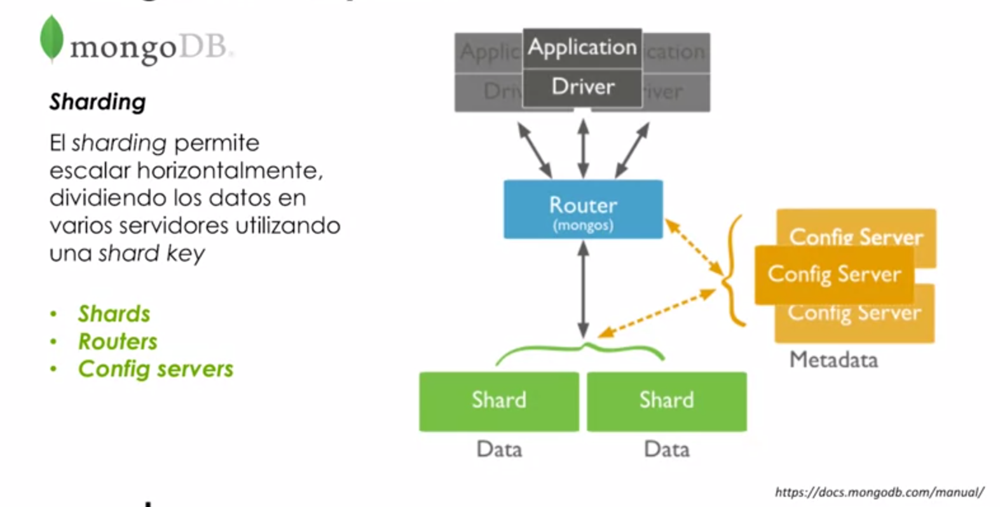

# Tecnologías BBDD NoSQL

## Origen, necesidad

* Recordamos las `4Vs`
    * Volumen: Enorme cantidad de datos
    * Velocidad: Generación y movimiento a gran velocidad.
    * Variedad: Distintos tipos.
    * Veracidad: El grado de confianza en los datos.

* Necesidad de implementación sistemas NoSQL a gran(`enorme`) escala.

  
## Situación actual. Tipos de aproximación: key-value, wide column store, document store

* `key-value store`: Registros clave-valor, donde cada clave tiene asociado un valor, y este valor no tiene nada que ver con el resto de valores, ni seguir una estructura definida.
* `wide column store`: Los registros están indexados mediante índices. Las familias de columnas se dividen en sub-columnas, y cada una de estas tiene su clave de columna y su respectivo valor.
* `document store`: Por cada registro tenemos un índice y el valor asociado al índice es lo que se conoce como documento. La estructura interna no debe ser(obligatoriamente) común entre los diversos documentos.

## Introducción a tecnologías actuales: HBASE, Cassandra, MongoDB
### HBASE
* 2007, Apache
* Integración Hadoop, HDFS
* Wde column store
* Escrita en Java, desarrollo a partir de BigTable
* Sistema CP (Consistencia de datos y tolerancia a la partición)
### Cassandra
* 2007 Facebook - 2009 Apache
* Alta escalabilidad y disponibilidad
* Wide column store
* Escrita en Java, muy buena integración con Hadoop y otras plataformas Big Data.
* Sistema AP(disponibilidad y tolerancia a particiones)
### MongoDB
* 2007 !0gen Inc. (MongoDB Inc.)
* Simplicidad en el desarrollo
* Document Store
* Escrita en C++, muy buena integración enm distintos casos de usos.
* Sistema CP (Consistencia de datos y tolerancia a la partición)
## Exploración tecnologías: modelos de datos y arquitectura

### HBASE


* ¡Vamos a imaginar que almacenamos todos los campos de todas las familias de columnas, la arquitectura de HBase lo que hace es un particionamiento horizontal de los datos, de modo que cada fragmento viene identificado por una clave de fila inicial y una clave de fila final.

* Una vez tenemos los datos particionados los datos, estos se distribuyen en diferentes regiones (distintas ubicaciones lógicas).
* Cada una de las regiones está gobernada por un servidor de región, y cada conjunto de regiones que están gobernadas por un servidor de región, pueden estar distribuidas geográficamente.
* En este esquema, hay dos componentes esenciales:
  * HMASTER: Demonio principal del sistema.
  * ZOOKEEPER: Elemento de coordinación distribuida esencial para el funcionamiento de toda la arquitectura.

    
### Cassandra


* Protocolo Gossip: cada nodo tiene comunicación constante y frecuente nodo a nodo. Se intercambian información de estado, tamaño disponible,etc.

  
> Esta arquitectura es escalable y se puede repetir en diferentes ubiucaciones. P.e. Dos DataCenter agrupados en un cluster.


### MongoDB
* Orientada a documentos: Los datos son más bastos que los de paradigma  en columnas 
* Los documentos se codifican mediante un tipo de datos llamado `BSON` (como json pero binario)
* Representación(Como objeto tipo JSON): 
```javascript
var mydoc = {
    _id: ObjectID("edfjsdlkj32423lk"),
    name:{ first:"Alan", last:"Turing"},
    birth: new Date('Jun 23, 1912'),
    death: new Date('Jun 07, 1954'),
    contribs: ["Turing machine", "Turing test", "Turingery"],
  views: NumberLong(1250000)
}
```
* Unidad Básica de datos: Documento (`BSON`)
  * Los documentos a su vez se pueden apilar en `Coleciones`. **Las bases de datos contienen colecciones de documentos, y estas colecciones podrán ser sub-divididas en chunks**
  

> Relaciones que se establece entre los diversos documentos. 
  * MongoDB proporciona una manera de relacionar los datos
      * `mediante enlaces`(utilizando los propios identificadores internos que se generan para cada documento)
      * con `documentos incrustados`(incrustar un sub-documento como valor de un determinado campo).
        
        
> Persistencia de datos


  
> Sharding




## Consideraciones: ¿Cuál escoger?


