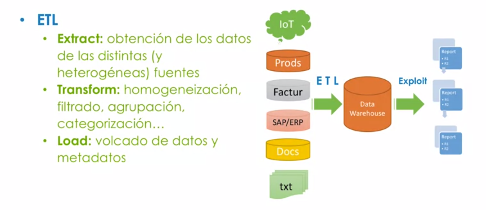
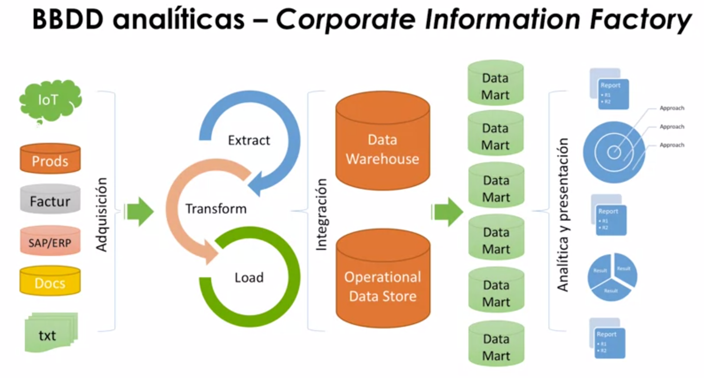
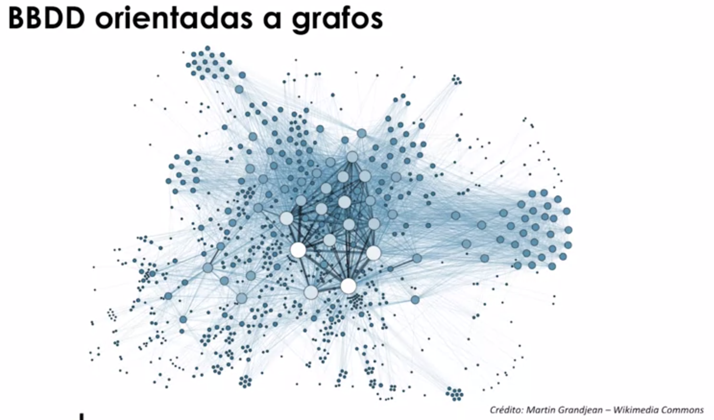
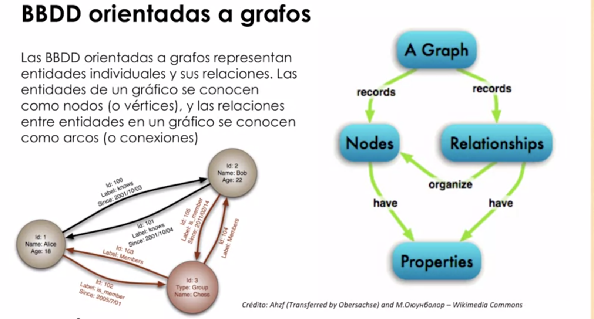

# Introducción a BBDD analíticas
## Origen, necesidad, Business intelligence
* Masiva cantidad de datos -> ¿Cómo analizamos?
    * Toma de decisiones
* Necesidad: análisis efectivo y eficiente de una masiva cantidad de datos
    * Inconvenientes:
        - Interferencia con sistema operacional
        - Ralentización y latencia
        - Heterogeneidad fuentes de datos
        - Fiabilidad, volatilidad.
## ETL y Data Warehouse
* DATA WAREHOUSE: es un "gran almacén" de datos, donde prima la **estructura de la información**-
    * Características:
        - Integrado: estructura consistente y homogeneidad.
        - Temático: categorización de los datos
        - Histórico: registra la tendencia y evolución de los datos.
        - No volátil: información se lee, no se modifica.

## Evolución componentes, Corporate Information Factory.

# Introducción a BBDD orientadas a grafos

## Definición conceptual
* La representación en forma de grafo permite que las relaciones entre los objetos sean claras.
* Obviamente, este tipo de BBDD se ve respaldada por todos los métodos propios de la teoría de Grafos.
* Los cálculos típicos vienen dados por la distancia de ruta más corta entre múltiples nodos en un grafo, o cuántos nodos tiene conexiones de cierto tipo con un nodo específico.

## Marco teórico: Teoría de grafos
* Algoritmos basados en Teroía de Grfos:
    * Page Rank
    * Shortest Path
    * Componentes conectadas
    * Clustering
    
* Herramientas de Graph processing:
    * Hadooop
    * Apache Giraph
    * Titan
    
## Ejemplos de uso

